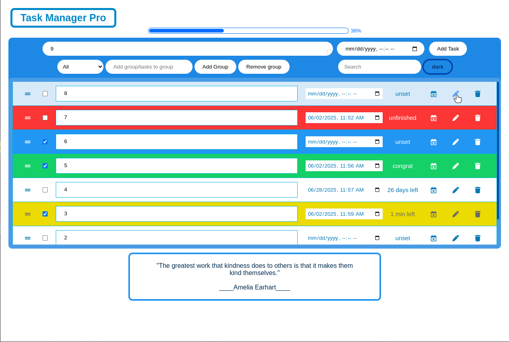
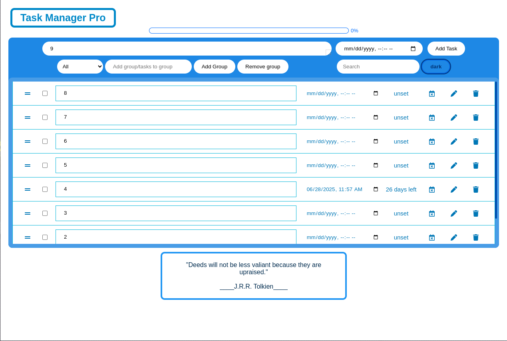
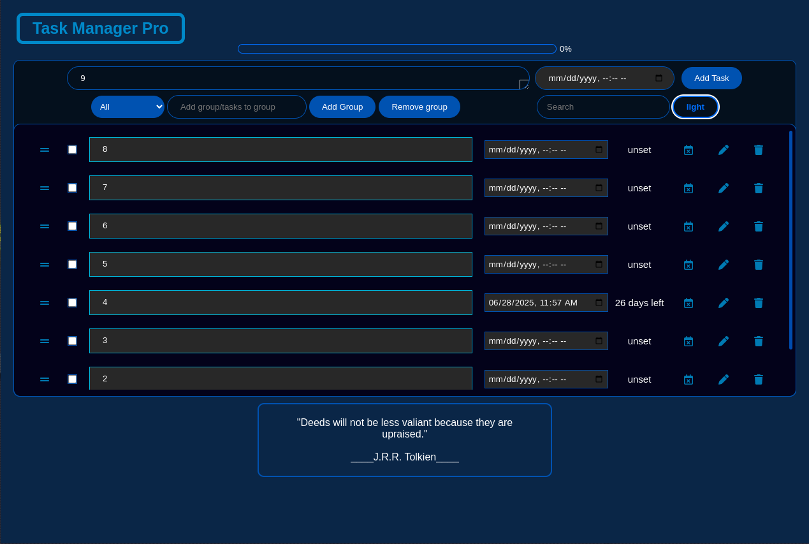

# 📋 Task Manager Pro

**Task Manager Pro** is a modern, responsive productivity app built with vanilla JavaScript, HTML, and CSS. It allows users to efficiently manage tasks with powerful features like group categorization, smart deadline alerts, dark mode, inspirational quotes, and drag-and-drop task sorting.

---

## 🚀 Features

- ✅ Add, edit, delete, and complete tasks
- 🗂️ Categorize tasks into custom groups
- ⏰ Set deadlines with automatic visual alerts
- 🧠 Real-time **deadline logic**: upcoming, overdue, completed on time
- 🧮 Completion **progress bar** with percentage tracking
- 🌗 Toggle between **Dark/Light mode** (saved with localStorage)
- 🔍 Search and filter tasks (All / Done / Undone / Group)
- 📦 Drag-and-drop task reordering
- 🔊 Sound feedback on actions
- 💬 Rotating inspirational quotes
- 🌐 Offline status detection & alert

---

| Light Mode                          | Dark Mode                           |
|------------------------------------|-------------------------------------|
|  |  |

---

## 🛠️ Built With

- HTML5
- CSS3 (Responsive & Dark Mode)
- Vanilla JavaScript (ES6+)
- Font Awesome (icons)
- `localStorage` API

---

Made by **Sweet Hieu**

GitHub: @EthanVuno5
